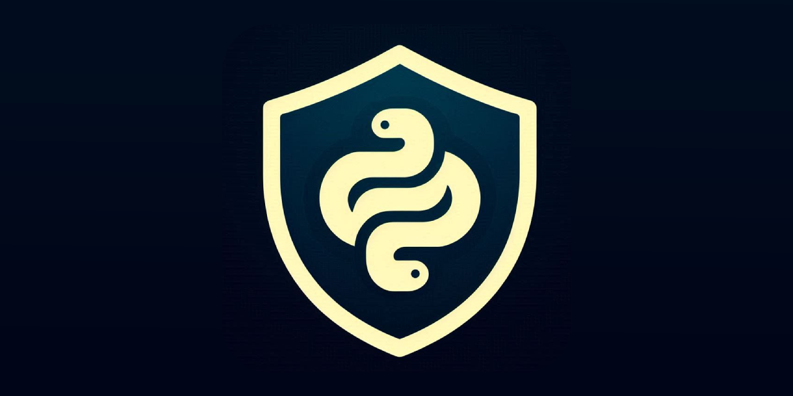

<a id="readme-top"></a>

<p align='center'>
</p>

<h3 align="center">PyGuard</h3>

<p align='center'>PyGuard is a Python obfuscation and anti-tampering library with modular architecture. It consists of a main obfuscation engine with multiple encryption layers, legacy obfuscation for backward compatibility, and runtime protection features.</p>

---

<h3>Table of Contents</h3>

<ul>
  <li><a href="#overview">Overview</a></li>
  <li><a href="#features">Features</a></li>
  <li><a href="#installation-and-usage">Installation and Usage</a></li>
  <li><a href="#configuration">Configuration</a></li>
  <li><a href="#building">Building Obfuscated Code</a></li>
  <li><a href="#contributing">Contributing</a></li>
  <li><a href="#known-issues">Known Issues</a></li>
  <li><a href="#troubleshooting">Troubleshooting</a></li>
  <li><a href="#license">License</a></li>
  <li><a href="#contact">Contact</a></li>
  <li><a href="#support-the-project">Support the Project</a></li>
</ul>

---

<h3><a id="overview"></a>Overview</h3>

PyGuard is a Python code protection tool that provides comprehensive obfuscation and anti-tampering capabilities. It offers two distinct obfuscation methods: a modern approach with layered encryption, runtime integrity checks, and anti-analysis protection; and a legacy method focused on preventing antivirus detection through compression and encryption layers.

The tool is designed for developers who need to protect their Python applications from decompilation, reverse engineering, static analysis, unauthorized modification and antivirus detection. PyGuard supports both single file and multi-file project obfuscation, with options to include dependencies and create standalone protected executables.

<p align="right">
  <a href="#readme-top" aria-label="Back to top">
    
  </a>
</p>

---

<h3><a id="features"></a>Features</h3>

**Multiple Encryption Layers**

> - Fernet symmetric encryption
> - AES-GCM-SIV for authenticated encryption
> - XChaCha20-Poly1305 for modern stream cipher protection
> - Base64 encoding with compression
> - Combine multiple layers for defense-in-depth security

**Advanced Obfuscation Techniques**

> - SHA-512 string hashing to protect sensitive literals
> - Recursive obfuscation with configurable depth
> - Code compression and byte manipulation
> - Randomized separators and identifiers
> - AST-based transformation for robust code handling

**Runtime Protection**

> - Anti-debugging detection (pdb, ipdb, pudb)
> - Profiler and tracer detection
> - Environment analysis for hostile conditions
> - Time-based anti-single-stepping protection
> - Secure memory wiping of sensitive data
> - Decoy code execution for hostile environments

**File & Project Protection**

> - Single file and multi-file project obfuscation
> - Directory recursion for complete project protection
> - Automatic import following for dependency management
> - File integrity verification with SHA-512 hashing
> - Tamper detection and prevention

**Two Obfuscation Modes**

> - **Modern Mode**: Maximum security with runtime protection, integrity checks, and native compilation
> - **Legacy Mode**: Lightweight obfuscation optimized for antivirus evasion
> - Both modes support multiple encryption algorithms and techniques

**Developer-Friendly Features**

> - Automatic import following for Nuitka compilation
> - Configurable output directory
> - Custom decoy code injection
> - Verbose and debug modes for development
> - Cross-platform support (Windows, Linux, macOS)
> - Python 3.12+ compatibility

**Build & Compilation**

> - Cython-based executor compilation to native extensions
> - Automatic platform detection (.pyd for Windows, .so for Unix)
> - Clean build process with intermediate file removal
> - Dead code elimination for unused protection layers

<p align="right">
  <a href="#readme-top" aria-label="Back to top">
    
  </a>
</p>

---

<h3><a id="installation-and-usage"></a>Installation and Usage</h3>

<h4>Installation</h4>

PyGuard requires **Python 3.12 or higher** and the following dependencies:

- `cryptography` - for Fernet and AES-GCM-SIV encryption
- `pycryptodome` - for ChaCha20-Poly1305 encryption
- `cython` - for executor compilation
- `nuitka` - for building standalone executables
- `colorama` - for cross-platform colored output
- `setuptools` - for build system integration

You can get PyGuard directly from [release section](https://github.com/ByteCorum/pyguard/releases) or clone from source.

**Cloning from source:**

```bash
git clone https://github.com/ByteCorum/pyguard.git
cd pyguard

# Virtual environment is recommended
python -m venv .venv
source .venv/bin/activate  # Linux/macOS
.\.venv\Scripts\activate   # Windows

python -m pip install --upgrade pip
pip3 install -r requirements.txt
```

<h4>Usage</h4>

After installation, you can run PyGuard from the source directory:

```bash
python -m src.main
```

Or build a standalone executable:

```bash
# Linux/macOS
chmod +x build-scripts/build-linux.sh # or build-mac.sh
./build-scripts/build-linux.sh

# Windows
build-scripts\build-win.cmd
```

This creates a single executable file (`pyguard` or `pyguard.exe`) that can be used directly.

<p align="right">
  <a href="#readme-top" aria-label="Back to top">
    
  </a>
</p>

---

<h3><a id="configuration"></a>Configuration</h3>

PyGuard can be configured through command-line options. All commands support general options:

<h4>Global Configuration</h4>

| Option         | Description                  |
| -------------- | ---------------------------- |
| `--help`       | Show help for commands       |
| `--quiet`      | Reduce output verbosity      |
| `--log <path>` | Duplicate all logs to a file |
| `--no-color`   | Disable colored output       |
| `--no-input`   | Disable interactive prompts  |

> [!NOTE]
> PyGuard offers two obfuscation methods: modern and legacy. We recommend using the modern method for maximum security with runtime protection and integrity checks. The legacy method is maintained for compatibility and antivirus evasion scenarios.

<h4>Obfuscation Configuration</h4>

The main obfuscation command supports extensive configuration:

```bash
# Enable all encryption layers
pyguard obfuscate --hashdata --fernet --aes --chacha --base64 --recursive 5 main.py

# For projects with imports
pyguard obfuscate --hashdata --aes --follow-imports --dirs features/ --files config.py,logger.py main.py

# With custom output and decoy code
pyguard obfuscate --hashdata --chacha --decoy decoy.py --output protected/ main.py

# For debug purposes with no integrity checks
pyguard obfuscate --hashdata --chacha --no-integrity --debug-error --debug main.py
```

<h4>Legacy Obfuscation Configuration</h4>

The legacy mode offers simpler configuration:

```bash
# Mode 4 with 6 loops
pyguard obfuscatelegacy --mode 4 --loops 6 --seplen 32 --files script.py

# For multiple files
pyguard obfuscatelegacy --mode 3 --loops 3 --dirs utils/,features/ --files main.py --output obfuscated/
```

<p align="right">
  <a href="#readme-top" aria-label="Back to top">
    
  </a>
</p>

---

<h3><a id="building"></a>Building Obfuscated Code</h3>

PyGuard is designed to be compatible with various Python build systems and compilation tools. While obfuscated code remains fully functional as Python scripts, compiling it to a binary executable provides an additional layer of protection.

**Recommended: Nuitka Integration**

We highly recommend using Nuitka to compile your obfuscated code into a standalone executable. PyGuard provides seamless integration:

```bash
# Obfuscate with import following for Nuitka
pyguard obfuscate --aes --chacha --follow-imports --output obfuscated/ main.py

# Then compile with Nuitka
nuitka --follow-imports --remove-output --mode="onefile" obfuscated/main.py
```

The `--follow-imports` flag automatically includes all necessary imports in your obfuscated code, making it compile-ready.

**Other Build Systems**

PyGuard works with any build system that processes Python code:

- **PyInstaller**: Use with obfuscated scripts directly
- **cx_Freeze**: Compatible with obfuscated code
- **Docker containers**: Obfuscate before building your image
- **Custom build scripts**: Integrate PyGuard into your pipeline

If you encounter any compatibility issues with a specific build system, please [report it](https://github.com/ByteCorum/pyguard/issues/new?template=bug-report.yml) and we'll prioritize fixing it.

<p align="right">
  <a href="#readme-top" aria-label="Back to top">
    
  </a>
</p>

---

<h3><a id="contributing"></a>Contributing</h3>

**Contributions are welcome**: bug reports, feature ideas, documentation improvements, and code.

Before you start:

- Read [CONTRIBUTING.md](docs/CONTRIBUTING.md) it covers the environment setup, branch and commit conventions, pull request expectations, and the AI-generated changes policy
- Check [open issues](https://github.com/ByteCorum/pyguard/issues) or start a [discussion](https://github.com/ByteCorum/pyguard/discussions) before significant work, to avoid duplicating effort

> [!NOTE]
> By participating in this project, you agree to abide by the [Code of Conduct](docs/CODE_OF_CONDUCT.md).

<p align="right">
  <a href="#readme-top" aria-label="Back to top">
    
  </a>
</p>

---

<h3><a id="known-issues"></a>Known Issues</h3>

Known bugs and planned work are tracked in [TODO.md](docs/TODO.md).
Everything listed there under "Known Issues" is either being fixed
or scheduled to be; anything not listed is unknown, so please
[report it](https://github.com/ByteCorum/pyguard/issues/new?labels=type%3A%20bug&template=bug_report.md).

> [!TIP]
> Before concluding something is a bug, check Troubleshooting below, as some behavior, that looks broken not depends on this project.

<p align="right">
  <a href="#readme-top" aria-label="Back to top">
    
  </a>
</p>

---

<h3><a id="troubleshooting"></a>Troubleshooting</h3>

<!--<h4>Symptom name</h4>

**Cause:** one or two sentences on why this happens.

**Fix:**

1. Configuration steps for the external component, copy-pasteable
2. Verification command or check -->

So far nothing

<p align="right">
  <a href="#readme-top" aria-label="Back to top">
    
  </a>
</p>

---

<h3><a id="license"></a>License</h3>

Distributed under the GPLv3 license.

Copyright (c) 2026 ByteCorum.

<p align="right">
  <a href="#readme-top" aria-label="Back to top">
    
  </a>
</p>

---

<h3><a id="contact"></a>Contact</h3>

<h4>Community</h4>

> [!NOTE]
> Before participating in this community, please read our [Code of Conduct](docs/CODE_OF_CONDUCT.md). By interacting with this repository or community you agree to abide by its terms.

All ways to contact the community or get help are listed in [SUPPORT.md](docs/SUPPORT.md), but short recap provided below.

- **Bug reports, feature requests, documentation issues** should be reported via issues using appropriate forms [here](https://github.com/ByteCorum/pyguard/issues/new/choose)
- **Usage questions** are answered in [Discussions](https://github.com/ByteCorum/pyguard/discussions/new?category=q-a), not the issue tracker.
- **Security Vulnerabilities** should be reported via Security and quality [tab](https://github.com/ByteCorum/pyguard/security/advisories/new)

<h4>Contact the Owner</h4>

Current contact options are listed in the [owner profile](https://github.com/ByteCorum)

> [!IMPORTANT]
> Do not email maintainers directly about support matters, because public questions get public answers, which benefits everyone.

<p align="right">
  <a href="#readme-top" aria-label="Back to top">
    
  </a>
</p>

---

<h3><a id="support-the-project"></a>Support the Project</h3>

If this project is useful to you, consider supporting its development.

All ways to donate are listed in the [author's profile](https://github.com/ByteCorum).

<p align="right">
  <a href="#readme-top" aria-label="Back to top">
    
  </a>
</p>

---
